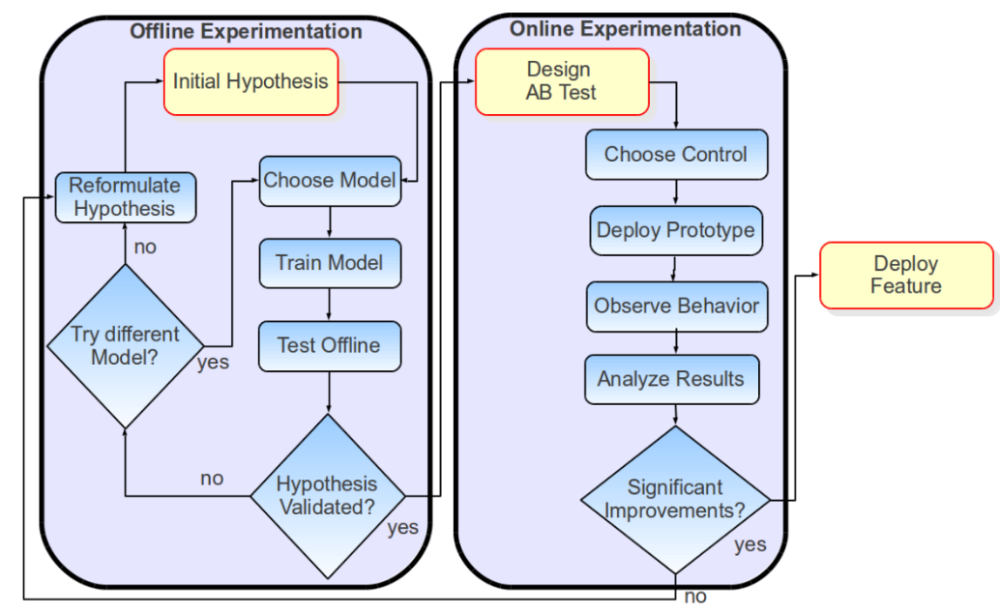

# Metodologías de Minería de Datos

Cada integrante del equipo eligió una empresa distinta en la que le gustaría trabajar e investigó qué metodología utiliza para desarrollar proyectos de Minería de Datos.

## Isaac
La empresa que elegí para investigar acerca de su metodología fue **IBM**, una empresa que abarca muchos sectores de la tecnología, incluyendo la Minería de Datos puesto que principalmente una de sus herramientas basadas en esta área es **SPSS Modeler** la cual adopta parte de la metodología *CRISP-DM* para el desarrollo de sus proyectos.\

**IBM** hace uso de la metodología **CRISP-DM** para guiar el proceso de desarrollo de proyectos de Minería de Datos, lo que les permite estructurar y organizar su trabajo de manera eficiente. Como dato curioso, **IBM** ha sido una de las empresas pioneras en la adopción de esta metodología, ya que fue una de las empresas que colaboró en el desarrollo de *CRISP-DM* en la década de 1990, lo que les ha permitido tener una profunda comprensión y experiencia en su aplicación.\
La herrmienta de **IBM** para la Minería de Datos, **SPSS Modeler**, permite a los usuarios desarrollar modelos de minería de datos haciendo uso de un entorno virtual, en donde, cada fase de CRISP-DM se puede llevar a cabo mediante procesos específicos que la misma herramienta ofrece, proporcinando el análisis de datos, la construcción de modelos y la evaluación de resultados de manera integrada. Esto facilita a los usuarios seguir la metodología de manera estructurada y obtener resultados significativos a partir de sus datos.\

Internamente en **IBM**, la metodología **CRISP-DM** se implementa en proyectos en donde se requiere de análisis de clientes, predicción de ventas/comportamiento y la toma de decisiones para la empresa a partir de los datos obtenidos. Aunque después de un tiempo, evoluciona a la metodología **ASUM-DM** (Analytics Solutions Unified Method for Data Mining) la cual es una versión actualizada de CRISP-DM, adaptada a las necesidades actuales de la industria y a los avances tecnológicos en el campo de la Minería de Datos.\

## Kevin

## Arlet

Gracias a la diversidad de fuentes de datos, mediciones y experimentos con los que cuenta Netflix, ha sido posible establecer una cultura a nivel global que le permite manejarse como una organización basada en datos, cuyo principal objetivo es inovar en pro de sus consumidores [@netflix].

Es por esto que como empresa buscan que la forma en la que desarrollan nuevas implementaciones de características, algoritmos o diseños permitan una evaluación rápida, económica y objetiva de nuevas ideas [@netflix]. Por ello, siguen un proceso llamado "A/B testing" [@netflix], la cual permite comparar la versión original con la versión de prueba, mediante la identificación del impacto que tiene (o no tiene) la característica de prueba en el comportamiento del usuario [@twilio_ab_testing]. 

La personalización es parte fundamental de la inovación en Netflix pues está estrechamente relacionado con su sistema de recomendación.Como se muestra en la Figura @fig-netflix, el proceso que siguen consta de una primera etapa de *experimentación offline* en la que se plantea una hipótesis y se eligen, entrenan y prueban modelos de forma iterativa hasta que se logra validar la hipótesis planteada. Para después continuar con una segunda etapa de *experimentación online* en la que se lleva a cabo el proceso del "A/B testing" que en caso de identificar mejoras importantes llevan al lanzamiento de la nueva característica.

{#fig-netflix}

Si bien, explícitamente no se menciona el nombre de alguna de las metodologías vistas en clase, en realidad al ser una empresa tan grande es posible identificar rasgos relacinados a algunas de ellas.
Por ejemplo, en el caso de CRISP-DM la misma política basada en datos que han establecido los lleva a tener que implementar etapas de entendimiento del negocio y los datos para evaluar aquellos puntos que impulsarían el crecimiento de la empresa e identificar los datos con los que cuentan para lograrlo. Luego, las etapas de preparación de datos, modelado, evaluación y despliegue se ven involucradas en la metodología vista anteriormente. Mientras que el interés por evaluar distintos modelos se relaciona fuertemente con las etapas de SEMMA (muestrear, explorar, modificar, modelar y evaluar).

## Seldon
Elegí la empresa Mercedes-Benz, en esta empresa, los proyectos de minería de datos se desarrollan bajo un enfoque estructurado y orientado al negocio que es consistente con la metodología CRISP-DM, la cual permite integrar el análisis de datos con objetivos estratégicos de la empresa. Esto se observa en aplicaciones como la optimización de procesos de manufactura, donde a partir de datos de producción se construyen modelos predictivos para reducir tiempos y mejorar la eficiencia, tal como se muestra en los estudios de Mercedes-Benz Greener Manufacturing (Dhilip Maharish, 2020; Ravindra,  2020; Preetham, 2020).

Asimismo, en iniciativas más recientes como la minería urbana, Mercedes-Benz utiliza datos para identificar, recuperar y reutilizar materiales provenientes de vehículos fuera de uso, lo que refleja una aplicación clara de las fases de comprensión del negocio, modelado y despliegue dentro de CRISP-DM, ahora enfocadas en sostenibilidad y economía circular (Energy Magazine, 2025).

En conjunto, estos casos muestran que la empresa no solo emplea técnicas de modelado y machine learning, sino que sigue un proceso completo de minería de datos que inicia con la definición del problema, continúa con el análisis y preparación de datos, y culmina con la implementación de soluciones en entornos reales. Esto confirma que CRISP-DM es una metodología adecuada para contextos industriales complejos, donde los datos deben traducirse en decisiones operativas y estratégicas con impacto tangible.

:::{.callout-note}
Entregable: un apartado breve por integrante, sustentado con citas de fuentes confiables.
:::